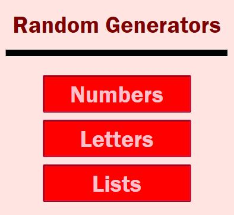
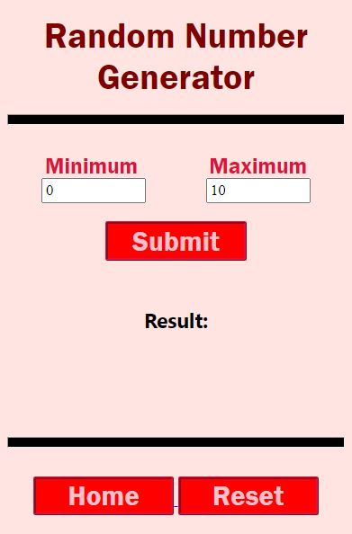
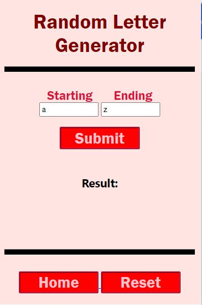
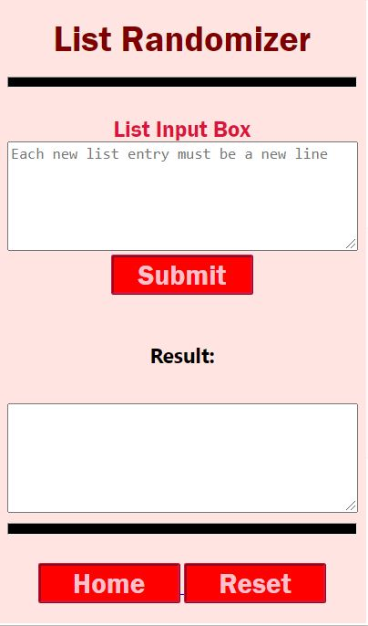

# Random Generator Chrome Extension
 Chrome extension for randomizing numbers, letters, and lists. 
 
# How To Install
 1. Download the repository as a zip file
 2. Extract the zip file
 3. Turn on developer mode in extensions
 4. Click on the load unpacked button and select the random generator chrome extension folder with the downloaded contents
 5. The extension should then be added to your list of extensions (You may need to pin it)
 6. Click on the extension icon and have fun using the random generator!

# Sample Images
   
